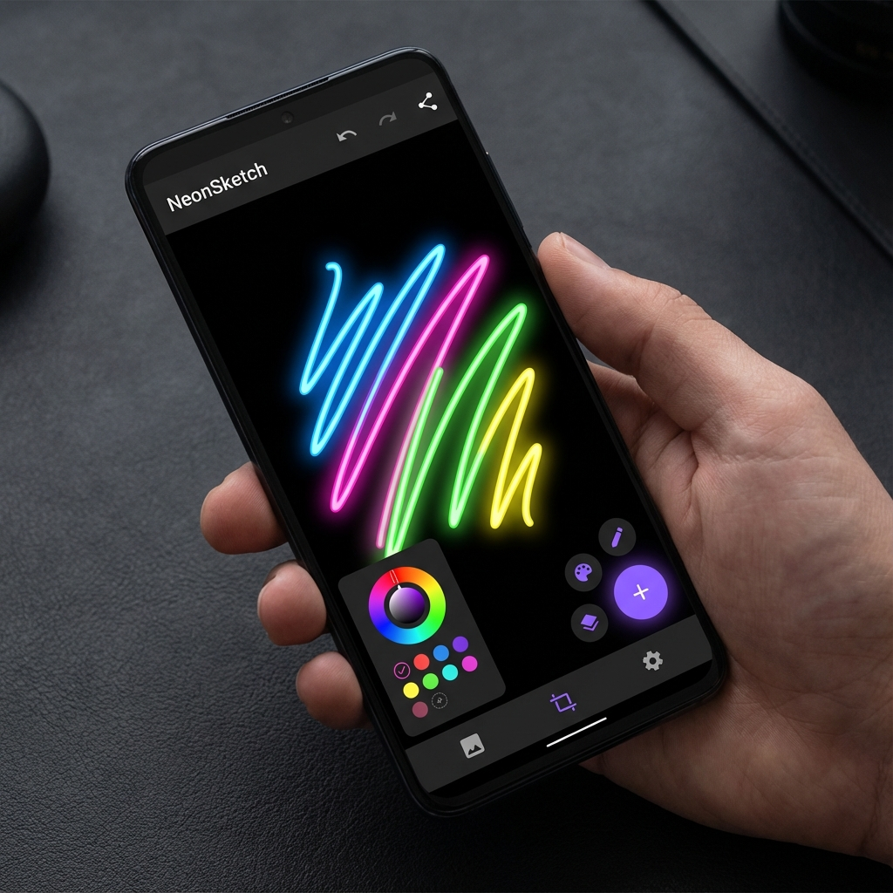
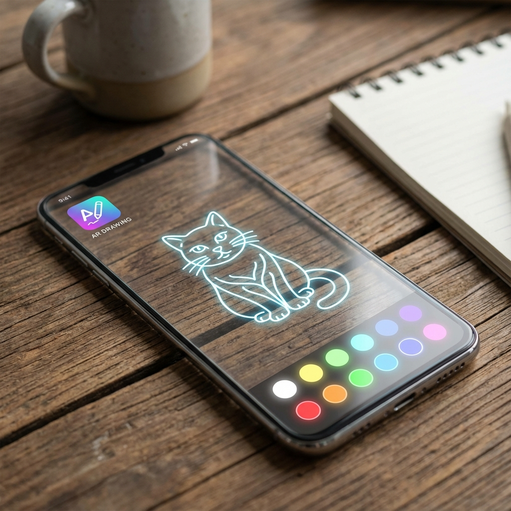

# 🎨 Smart Sketchbook 2025

**The Future of Mobile Creativity is Here.**



<div align="center">


**Smart Sketchbook 2025** is not just a drawing app. It's an intelligent canvas that bridges the gap between your imagination and reality. Powered by **Gemini Nano** and **ARCore**, it transforms simple sketches into masterpieces and lets you draw on the world itself.

[Features](#-features) • [Tech Stack](#-tech-stack) • [Getting Started](#-getting-started) • [Roadmap](#-roadmap)

</div>

---

## ✨ Features

### 🖌️ Professional Drawing Engine
Experience a buttery-smooth drawing experience with our custom-built, high-performance engine.
- **Dynamic Strokes**: Pressure-sensitive simulation with adjustable stroke width (1px - 50px).
- **Infinite Colors**: A brand new **Interactive Color Wheel** lets you pick the perfect hue and saturation.
- **Zero Lag**: Optimized bitmap caching ensures your creativity never hits a speed bump.

### 🤖 AI Magic (Gemini Nano)
Unleash the power of on-device AI.
- **Neon Glow Hallucinations**: Watch as the AI interprets your strokes and adds a futuristic neon aesthetic with a single tap.
- **Smart Optimization**: (Coming Soon) Auto-correction and style transfer running entirely offline.

### 👓 AR Mode (Augmented Reality)
Why limit yourself to a screen?
- **Draw on the World**: Activate AR Mode to overlay your digital canvas onto the physical world.
- **Trace & Create**: Perfect for tracing real-world objects or leaving digital graffiti in your living room.



---

## 🛠️ Tech Stack

Built with the cutting-edge **Android 2025** stack:

- **Language**: Kotlin 2.0
- **UI Framework**: Jetpack Compose (Material3)
- **Camera**: CameraX 1.4.1 (for AR overlay)
- **Graphics**: Native Canvas & Path API with Bitmap Caching
- **Architecture**: MVVM + Clean Architecture principles

## 🚀 Getting Started

1.  **Clone the repo**:
    ```bash
    git clone https://github.com/yourusername/SmartSketchbook2025.git
    ```
2.  **Open in Android Studio** (Koala 2025 or newer recommended).
3.  **Sync Gradle** to download dependencies.
4.  **Run on Device**:
    - For **AR Mode**, a physical device with a camera is required.
    - For **AI Magic**, any Android 10+ device works (Gemini Nano features optimized for Pixel 9/Samsung S25).

## 🔮 Roadmap

- [x] **Phase 1**: Core Drawing Engine & UI (Completed)
- [x] **Phase 2**: AR Camera Overlay & Basic AI Effects (Completed)
- [ ] **Phase 3**: Full Gemini Nano Integration for Text-to-Image generation
- [ ] **Phase 4**: Cloud Sync & Community Gallery

---

<div align="center">

**Crafted with ❤️ and 🤖 by Keren**

*Part of the "From Android Developer → Senior Mobile AI Engineer" Master Plan*

</div>
